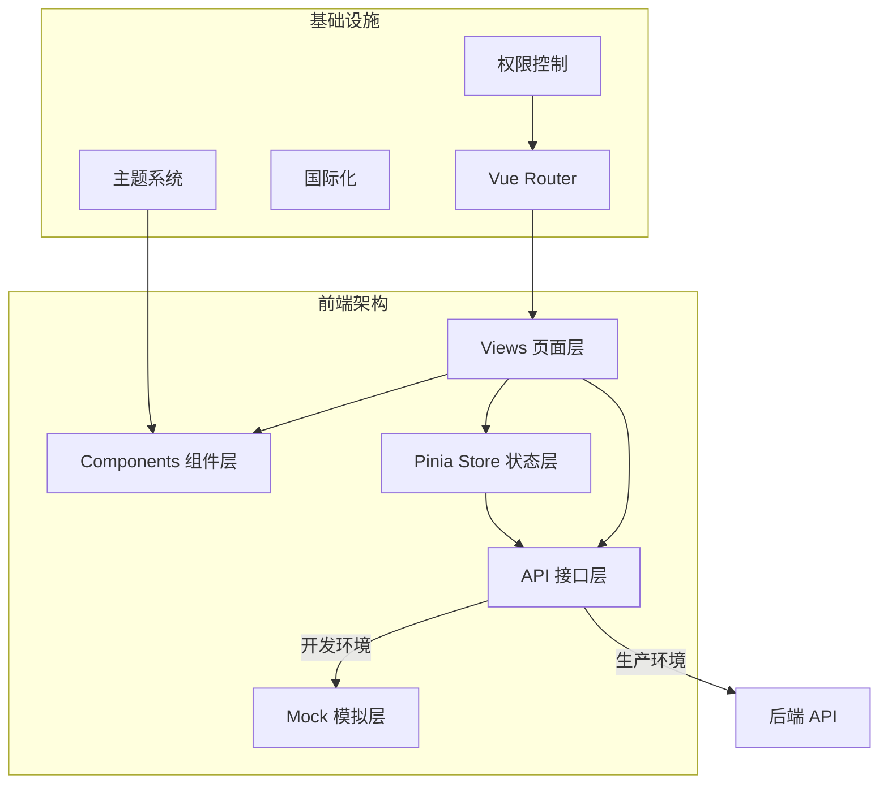
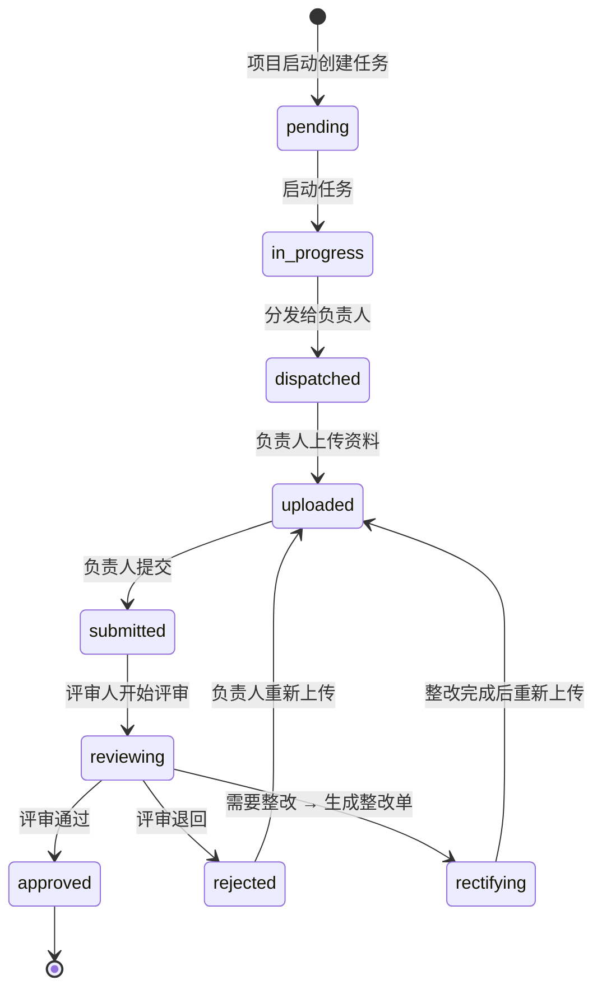
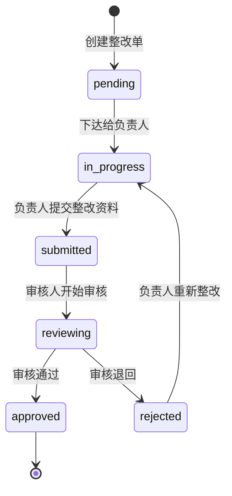
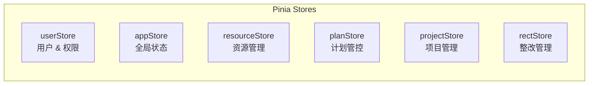

# IRIS 前端开发设计文档

> **项目**: IT风险及内控管理平台 (IRIS)
> **技术栈**: Vue 3 + TypeScript + Vite + Element Plus + Pinia + ECharts
> **文档版本**: v1.0 | 2026-02-12

---

## 一、整体架构



---

## 二、数据模型设计

### 2.1 通用类型

```typescript
// types/common.ts

/** 分页请求 */
interface PageQuery {
  page: number;
  pageSize: number;
  keyword?: string;
  sortBy?: string;
  sortOrder?: "asc" | "desc";
}

/** 分页响应 */
interface PageResult<T> {
  list: T[];
  total: number;
  page: number;
  pageSize: number;
}

/** 通用附件 */
interface Attachment {
  id: string;
  name: string;
  url: string;
  size: number;
  type: string; // MIME type
  uploadedBy: string;
  uploadedAt: string;
}

/** 操作日志 */
interface OperationLog {
  id: string;
  action: string;
  operator: string;
  operatorName: string;
  remark?: string;
  createdAt: string;
}
```

### 2.2 模块一：资源管理

```typescript
// types/resource.ts

/** 标准文档分类 */
type StandardCategory = "law" | "system" | "industry" | "internal";

/** 标准文档 */
interface Standard {
  id: string;
  title: string;
  category: StandardCategory;
  version: string;
  publishDate: string;
  status: "draft" | "active" | "archived";
  attachments: Attachment[];
  tags: string[];
  description?: string;
  createdAt: string;
  updatedAt: string;
}

/** 内控清单 */
interface ControlChecklist {
  id: string;
  code: string; // 编号
  name: string;
  description?: string;
  items: ChecklistItem[];
  status: "draft" | "active" | "disabled";
  createdAt: string;
}

/** 清单项 */
interface ChecklistItem {
  id: string;
  checklistId: string;
  sequence: number; // 序号
  content: string; // 检查内容
  criterion: string; // 检查标准
  method?: string; // 检查方法
  riskLevel: "high" | "medium" | "low";
}

/** 档案 */
interface Archive {
  id: string;
  projectId: string;
  projectName: string;
  archiveDate: string;
  documents: ArchiveDocument[];
  status: "active" | "sealed";
}

interface ArchiveDocument {
  id: string;
  archiveId: string;
  category: string;
  attachments: Attachment[];
}

/** 内控人员 */
interface Personnel {
  id: string;
  name: string;
  department: string;
  position: string;
  phone?: string;
  email?: string;
  roles: PersonnelRole[];
  skills: string[];
  status: "active" | "inactive";
}

type PersonnelRole = "auditor" | "reviewer" | "leader" | "member" | "expert";
```

### 2.3 模块二：内控计划管控

```typescript
// types/plan.ts

type PlanCycle = "monthly" | "quarterly" | "yearly";
type PlanStatus =
  | "draft"
  | "pending"
  | "approved"
  | "in_progress"
  | "completed"
  | "cancelled";

/** 内控计划 */
interface ControlPlan {
  id: string;
  code: string;
  name: string;
  cycle: PlanCycle;
  year: number;
  period: string; // 如 "2026-Q1", "2026-03"
  status: PlanStatus;
  description?: string;
  items: PlanItem[];
  createdBy: string;
  approvedBy?: string;
  createdAt: string;
  updatedAt: string;
}

/** 计划项 */
interface PlanItem {
  id: string;
  planId: string;
  sequence: number;
  targetScope: string; // 检查范围
  checklistIds: string[]; // 关联的内控清单
  plannedStartDate: string;
  plannedEndDate: string;
  assignee?: string; // 负责人
  remark?: string;
  projectId?: string; // 生成的项目ID
}

/** 计划变更记录 */
interface PlanChange {
  id: string;
  planId: string;
  changeType: "add" | "modify" | "delete" | "reschedule";
  description: string;
  beforeSnapshot?: string; // JSON
  afterSnapshot?: string;
  status: "pending" | "approved" | "rejected";
  applicant: string;
  reviewer?: string;
  createdAt: string;
}
```

### 2.4 模块三：内控项目管理

```typescript
// types/project.ts

type ProjectSource = "plan" | "manual";
type ProjectStatus =
  | "preparing"
  | "in_progress"
  | "closing"
  | "completed"
  | "archived";

/** 内控项目 */
interface Project {
  id: string;
  code: string;
  name: string;
  source: ProjectSource;
  planId?: string;
  status: ProjectStatus;
  description?: string;
  startDate: string;
  endDate?: string;
  team: TeamMember[];
  tasks: CheckTask[];
  createdBy: string;
  createdAt: string;
}

/** 团队成员 */
interface TeamMember {
  id: string;
  personnelId: string;
  personnelName: string;
  role: "leader" | "auditor" | "reviewer" | "member";
}

/** 核查任务状态（状态机） */
type TaskStatus =
  | "pending" // 待启动
  | "in_progress" // 进行中
  | "dispatched" // 已分发
  | "uploaded" // 资料已上传
  | "submitted" // 已提交
  | "reviewing" // 评审中
  | "approved" // 已通过
  | "rejected" // 已退回
  | "rectifying"; // 需整改

/** 核查任务 */
interface CheckTask {
  id: string;
  projectId: string;
  checklistItemId: string;
  checkContent: string;
  assigneeId?: string;
  assigneeName?: string;
  reviewerId?: string;
  reviewerName?: string;
  status: TaskStatus;
  attachments: Attachment[];
  reviewComment?: string;
  logs: OperationLog[];
  createdAt: string;
  updatedAt: string;
}
```

### 2.5 模块四：整改管理

```typescript
// types/rectification.ts

type RectSource = "task" | "manual";
type RectStatus =
  | "pending"
  | "in_progress"
  | "submitted"
  | "reviewing"
  | "approved"
  | "rejected";

/** 整改单 */
interface RectificationOrder {
  id: string;
  code: string;
  source: RectSource;
  taskId?: string;
  projectId?: string;
  title: string;
  description: string;
  assigneeId: string;
  assigneeName: string;
  reviewerId: string;
  reviewerName: string;
  status: RectStatus;
  deadline: string;
  attachments: Attachment[];
  reviewComment?: string;
  logs: OperationLog[];
  createdAt: string;
  updatedAt: string;
}
```

### 2.6 模块五：内控工作台

```typescript
// types/workbench.ts

/** 驾驶舱统计数据 */
interface DashboardStats {
  projectOverview: {
    total: number;
    inProgress: number;
    completed: number;
    overdue: number;
  };
  taskOverview: {
    total: number;
    pending: number;
    inProgress: number;
    completed: number;
    rejected: number;
  };
  rectificationOverview: {
    total: number;
    open: number;
    closed: number;
    overdueRate: number;
  };
  recentProjects: Project[];
  todoList: TodoItem[];
}

interface TodoItem {
  id: string;
  type: "task" | "rectification" | "review";
  title: string;
  deadline?: string;
  sourceId: string;
  priority: "high" | "medium" | "low";
}

/** 告警 */
interface AlertEvent {
  id: string;
  source: string; // 来源系统
  level: "critical" | "warning" | "info";
  title: string;
  content: string;
  timestamp: string;
  acknowledged: boolean;
}

/** 日志 */
interface LogEntry {
  id: string;
  source: string;
  level: "error" | "warn" | "info" | "debug";
  message: string;
  detail?: string;
  timestamp: string;
}
```

### 2.7 模块六：智能内控

```typescript
// types/smart.ts

/** 规则 */
interface Rule {
  id: string;
  name: string;
  description: string;
  category: string;
  expression: string; // 规则表达式
  triggerType: "manual" | "scheduled" | "event";
  schedule?: string; // cron 表达式
  status: "active" | "disabled";
  lastRunAt?: string;
  executionLogs: RuleExecution[];
}

interface RuleExecution {
  id: string;
  ruleId: string;
  status: "success" | "failure";
  result?: string;
  executedAt: string;
}

/** 模型 */
interface AIModel {
  id: string;
  name: string;
  type: "llm" | "ml";
  provider: string; // 供应商
  endpoint: string;
  apiKey?: string;
  description: string;
  status: "online" | "offline";
}

/** 工具 */
interface Tool {
  id: string;
  name: string;
  type: string; // OCR, NLP 等
  description: string;
  endpoint: string;
  status: "available" | "unavailable";
  config?: Record<string, unknown>;
}
```

---

## 三、页面布局设计

### 3.1 主布局结构

```
┌──────────────────────────────────────────────────┐
│  顶部导航栏 (64px)                                │
│  Logo | 面包屑                  用户头像 | 消息通知  │
├────────────┬─────────────────────────────────────┤
│            │                                     │
│  侧边菜单   │        内容区域                      │
│  (220px)   │                                     │
│            │   ┌─────────────────────────────┐   │
│  📂 资源管理 │   │  PageHeader                 │   │
│  📋 计划管控 │   │  标题 + 操作按钮              │   │
│  📁 项目管理 │   ├─────────────────────────────┤   │
│  🔧 整改管理 │   │                             │   │
│  📊 工作台   │   │  Page Content               │   │
│  🤖 智能内控 │   │                             │   │
│            │   │                             │   │
│            │   │                             │   │
│            │   └─────────────────────────────┘   │
│            │                                     │
├────────────┴─────────────────────────────────────┤
│  底部 (可选)                                      │
└──────────────────────────────────────────────────┘
```

### 3.2 驾驶舱布局

```
┌──────────────────────────────────────────────────┐
│  ┌──────┐ ┌──────┐ ┌──────┐ ┌──────┐            │
│  │项目总数│ │进行中 │ │已完成 │ │逾期   │  统计卡片   │
│  │  42   │ │  12  │ │  28  │ │  2   │            │
│  └──────┘ └──────┘ └──────┘ └──────┘            │
├─────────────────────┬────────────────────────────┤
│                     │                            │
│  项目状态分布饼图     │  月度趋势折线图              │
│  (ECharts)          │  (ECharts)                 │
│                     │                            │
├─────────────────────┼────────────────────────────┤
│                     │                            │
│  待办事项列表         │  近期告警滚动               │
│  ☐ 审核XX任务        │  🔴 系统A连接异常           │
│  ☐ 评审XX整改单      │  🟡 系统B响应时间增加        │
│  ☐ 完成XX报告        │  🔵 系统C升级完成           │
│                     │                            │
└─────────────────────┴────────────────────────────┘
```

### 3.3 项目详情页布局

```
┌──────────────────────────────────────────────────┐
│  < 返回列表    项目名称: XXX年度内控检查             │
│               状态: [进行中]    创建时间: 2026-01-15 │
├──────────────────────────────────────────────────┤
│  [概览] [核查清单] [项目团队] [项目文档] [操作日志]    │
├──────────────────────────────────────────────────┤
│                                                  │
│  Tab: 核查清单                                    │
│  ┌────┬──────────┬──────┬──────┬──────┬────────┐ │
│  │序号│ 检查内容   │ 负责人 │ 状态  │ 更新时间│ 操作   │ │
│  ├────┼──────────┼──────┼──────┼──────┼────────┤ │
│  │ 1  │ 用户权限.. │ 张三  │ 评审中 │ 02-10 │ 查看   │ │
│  │ 2  │ 数据备份.. │ 李四  │ 已通过 │ 02-08 │ 查看   │ │
│  │ 3  │ 网络安全.. │ 王五  │ 待启动 │ 02-05 │ 启动   │ │
│  └────┴──────────┴──────┴──────┴──────┴────────┘ │
│                                                  │
└──────────────────────────────────────────────────┘
```

### 3.4 任务详情页布局

```
┌──────────────────────────────────────────────────┐
│  < 返回项目    任务: 用户权限管理检查                 │
├──────────────────┬───────────────────────────────┤
│                  │                               │
│  任务信息         │  操作面板                      │
│  ──────────      │  ──────────                   │
│  检查内容: ...    │  当前状态: [已提交]              │
│  检查标准: ...    │                               │
│  负责人: 张三     │  ┌───────────────────────┐    │
│  评审人: 王总     │  │  [通过] [退回] [生成整改] │    │
│  截止日期: ...    │  └───────────────────────┘    │
│                  │                               │
│  附件资料         │  评审意见                      │
│  ──────────      │  ┌───────────────────────┐    │
│  📄 检查报告.docx │  │                       │    │
│  📄 截图证据.zip  │  │  请输入评审意见...       │    │
│  [+ 上传文件]     │  │                       │    │
│                  │  └───────────────────────┘    │
│  操作时间线       │                               │
│  ──────────      │                               │
│  ● 02-10 提交    │                               │
│  ● 02-08 上传    │                               │
│  ● 02-05 启动    │                               │
│                  │                               │
└──────────────────┴───────────────────────────────┘
```

---

## 四、状态机设计

### 4.1 核查任务状态机



**各角色可执行操作**:

| 状态        | 项目负责人 | 任务负责人 | 评审人                 |
| ----------- | ---------- | ---------- | ---------------------- |
| pending     | 启动       | —          | —                      |
| in_progress | 分发       | —          | —                      |
| dispatched  | —          | 上传资料   | —                      |
| uploaded    | —          | 提交       | —                      |
| submitted   | —          | —          | 开始评审               |
| reviewing   | —          | —          | 通过 / 退回 / 生成整改 |
| rejected    | —          | 重新上传   | —                      |
| rectifying  | —          | 重新上传   | —                      |

### 4.2 整改单状态机



---

## 五、API 接口规范

### 5.1 RESTful 约定

```
基础路径: /api/v1

命名规则:
  列表:   GET    /api/v1/{module}
  详情:   GET    /api/v1/{module}/{id}
  创建:   POST   /api/v1/{module}
  更新:   PUT    /api/v1/{module}/{id}
  删除:   DELETE /api/v1/{module}/{id}
  操作:   POST   /api/v1/{module}/{id}/{action}
```

### 5.2 各模块 API 清单

#### 资源管理

```
GET    /api/v1/standards              # 标准列表
POST   /api/v1/standards              # 创建标准
GET    /api/v1/standards/:id          # 标准详情
PUT    /api/v1/standards/:id          # 更新标准
DELETE /api/v1/standards/:id          # 删除标准
POST   /api/v1/standards/:id/upload   # 上传附件

GET    /api/v1/checklists             # 清单列表
POST   /api/v1/checklists             # 创建清单
POST   /api/v1/checklists/import      # 导入清单

GET    /api/v1/archives               # 档案台账
GET    /api/v1/archives/:id           # 档案详情

GET    /api/v1/personnel              # 人员列表
POST   /api/v1/personnel              # 添加人员
GET    /api/v1/roles                  # 角色列表
```

#### 计划管控

```
GET    /api/v1/plans                  # 计划列表
POST   /api/v1/plans                  # 创建计划
GET    /api/v1/plans/:id              # 计划详情
PUT    /api/v1/plans/:id              # 更新计划
POST   /api/v1/plans/:id/submit      # 提交审批
POST   /api/v1/plans/:id/approve     # 审批通过
POST   /api/v1/plans/:id/changes     # 提交变更
POST   /api/v1/plans/:id/generate    # 生成项目
```

#### 项目管理

```
GET    /api/v1/projects               # 项目列表
POST   /api/v1/projects               # 创建项目
GET    /api/v1/projects/:id           # 项目详情
PUT    /api/v1/projects/:id           # 更新项目
POST   /api/v1/projects/:id/close     # 项目收尾
POST   /api/v1/projects/:id/archive   # 项目归档

GET    /api/v1/projects/:id/tasks     # 任务列表
GET    /api/v1/tasks/:id              # 任务详情
POST   /api/v1/tasks/:id/start       # 启动任务
POST   /api/v1/tasks/:id/dispatch    # 分发任务
POST   /api/v1/tasks/:id/upload      # 上传资料
POST   /api/v1/tasks/:id/submit      # 提交
POST   /api/v1/tasks/:id/review      # 评审(通过/退回/整改)
```

#### 整改管理

```
GET    /api/v1/rectifications         # 整改列表
POST   /api/v1/rectifications         # 创建整改单
GET    /api/v1/rectifications/:id     # 整改详情
POST   /api/v1/rectifications/:id/submit  # 提交整改
POST   /api/v1/rectifications/:id/review  # 评审
```

#### 工作台

```
GET    /api/v1/dashboard/stats        # 驾驶舱统计
GET    /api/v1/dashboard/todos        # 待办列表
GET    /api/v1/alerts                 # 告警列表
PUT    /api/v1/alerts/:id/ack         # 确认告警
GET    /api/v1/logs                   # 日志查询
```

#### 智能内控

```
GET    /api/v1/analysis/project       # 项目分析
GET    /api/v1/analysis/annual        # 年度分析
GET    /api/v1/rules                  # 规则列表
POST   /api/v1/rules                  # 创建规则
POST   /api/v1/rules/:id/execute     # 执行规则
GET    /api/v1/models                 # 模型列表
GET    /api/v1/tools                  # 工具列表
```

### 5.3 Axios 封装设计

```typescript
// api/request.ts 核心逻辑

const service = axios.create({
  baseURL: import.meta.env.VITE_API_BASE_URL,
  timeout: 30000,
});

// 请求拦截：注入 Token
service.interceptors.request.use((config) => {
  const token = useUserStore().token;
  if (token) config.headers.Authorization = `Bearer ${token}`;
  return config;
});

// 响应拦截：统一错误处理
service.interceptors.response.use(
  (response) => response.data,
  (error) => {
    if (error.response?.status === 401) {
      // 跳转登录
    }
    ElMessage.error(error.response?.data?.message || "请求失败");
    return Promise.reject(error);
  },
);
```

---

## 六、Store 设计



| Store           | 职责                     | 关键 State                                  |
| --------------- | ------------------------ | ------------------------------------------- |
| `userStore`     | 用户登录、Token、权限    | `token`, `userInfo`, `permissions`          |
| `appStore`      | 侧边栏、面包屑、全局设置 | `sidebarCollapsed`, `breadcrumbs`, `theme`  |
| `resourceStore` | 缓存标准/清单/人员数据   | `standards`, `checklists`, `personnel`      |
| `planStore`     | 计划列表、当前计划       | `plans`, `currentPlan`                      |
| `projectStore`  | 项目列表、当前项目/任务  | `projects`, `currentProject`, `currentTask` |
| `rectStore`     | 整改单列表               | `rectifications`                            |

---

## 七、路由设计

### 路由结构

```typescript
// router/index.ts

const routes = [
  {
    path: "/login",
    component: () => import("@/views/login/index.vue"),
    meta: { requiresAuth: false },
  },
  {
    path: "/",
    component: AppLayout,
    redirect: "/workbench/dashboard",
    children: [
      // 模块 1: 资源管理
      {
        path: "resource",
        meta: { title: "资源管理", icon: "Folder" },
        children: [
          { path: "standards", meta: { title: "标准管理" } },
          { path: "checklists", meta: { title: "内控清单管理" } },
          { path: "archives", meta: { title: "档案管理" } },
          { path: "personnel", meta: { title: "人员管理" } },
        ],
      },
      // 模块 2: 计划管控
      {
        path: "plan",
        meta: { title: "内控计划管控", icon: "Calendar" },
        children: [
          { path: "create", meta: { title: "计划编制" } },
          { path: "list", meta: { title: "计划管理" } },
          { path: "overview", meta: { title: "计划一览" } },
        ],
      },
      // 模块 3: 项目管理
      {
        path: "project",
        meta: { title: "内控项目管理", icon: "OfficeBuilding" },
        children: [
          { path: "list", meta: { title: "项目列表" } },
          { path: "create", meta: { title: "项目启动" } },
          { path: "detail/:id", meta: { title: "项目详情" } },
          { path: "task/:id", meta: { title: "任务详情" } },
        ],
      },
      // 模块 4: 整改管理
      {
        path: "rectification",
        meta: { title: "整改管理", icon: "SetUp" },
        children: [
          { path: "list", meta: { title: "整改单列表" } },
          { path: "create", meta: { title: "创建整改单" } },
          { path: "detail/:id", meta: { title: "整改详情" } },
        ],
      },
      // 模块 5: 工作台
      {
        path: "workbench",
        meta: { title: "内控工作台", icon: "Monitor" },
        children: [
          { path: "dashboard", meta: { title: "驾驶舱" } },
          { path: "alerts", meta: { title: "告警中心" } },
          { path: "logs", meta: { title: "日志中心" } },
        ],
      },
      // 模块 6: 智能内控
      {
        path: "smart",
        meta: { title: "智能内控", icon: "MagicStick" },
        children: [
          { path: "analysis", meta: { title: "统计分析" } },
          { path: "rules", meta: { title: "规则库" } },
          { path: "models", meta: { title: "模型库" } },
          { path: "tools", meta: { title: "工具库" } },
        ],
      },
    ],
  },
];
```

### 路由守卫

```typescript
router.beforeEach(async (to, from, next) => {
  const userStore = useUserStore();

  if (to.meta.requiresAuth === false) return next();

  if (!userStore.token) return next("/login");

  // 首次加载：获取用户信息 & 权限
  if (!userStore.userInfo) {
    await userStore.fetchUserInfo();
  }

  // 权限校验
  if (to.meta.permission && !userStore.hasPermission(to.meta.permission)) {
    return next("/403");
  }

  next();
});
```

---

## 八、主题与样式

### CSS 变量体系

```css
/* styles/variables.css */

:root {
  /* 主色 */
  --iris-primary: #2563eb;
  --iris-primary-light: #60a5fa;
  --iris-primary-dark: #1d4ed8;

  /* 语义色 */
  --iris-success: #22c55e;
  --iris-warning: #f59e0b;
  --iris-danger: #ef4444;
  --iris-info: #6366f1;

  /* 中性色 */
  --iris-bg: #f5f7fa;
  --iris-bg-card: #ffffff;
  --iris-border: #e4e7ed;
  --iris-text-primary: #303133;
  --iris-text-secondary: #606266;
  --iris-text-muted: #909399;

  /* 布局 */
  --iris-sidebar-width: 220px;
  --iris-header-height: 64px;
  --iris-border-radius: 8px;
  --iris-shadow: 0 2px 12px rgba(0, 0, 0, 0.06);
}
```

### Element Plus 主题覆盖

```typescript
// vite.config.ts
export default defineConfig({
  css: {
    preprocessorOptions: {
      scss: {
        additionalData: `@use "@/styles/element-theme.scss" as *;`,
      },
    },
  },
});
```

### 响应式断点

| 断点 | 宽度        | 布局调整             |
| ---- | ----------- | -------------------- |
| `xs` | < 768px     | 侧边栏隐藏，菜单抽屉 |
| `sm` | 768–1024px  | 侧边栏折叠           |
| `md` | 1024–1440px | 正常布局             |
| `lg` | > 1440px    | 加宽内容区           |

---

## 九、公共组件规格

| 组件               | Props                                      | Events                       | 说明                  |
| ------------------ | ------------------------------------------ | ---------------------------- | --------------------- |
| `IrisPageHeader`   | `title`, `subtitle`, `back`                | —                            | 统一页面标题 + 面包屑 |
| `IrisDataTable`    | `columns`, `data`, `loading`, `pagination` | `page-change`, `sort-change` | 增强表格              |
| `IrisSearchBar`    | `fields`, `model`                          | `search`, `reset`            | 通用搜索表单          |
| `IrisFileUploader` | `accept`, `limit`, `action`                | `success`, `remove`          | 文件上传              |
| `IrisFilePreview`  | `file`                                     | —                            | 文档预览弹窗          |
| `IrisStatusTag`    | `status`, `statusMap`                      | —                            | 状态标签              |
| `IrisTimeline`     | `items`                                    | —                            | 操作日志时间线        |
| `IrisWorkflowBar`  | `status`, `role`, `actions`                | `action`                     | 任务流转操作栏        |
| `IrisStatCard`     | `title`, `value`, `icon`, `trend`          | —                            | 数字统计卡片          |
| `IrisDetailPanel`  | `fields`, `data`                           | —                            | 详情字段展示          |
