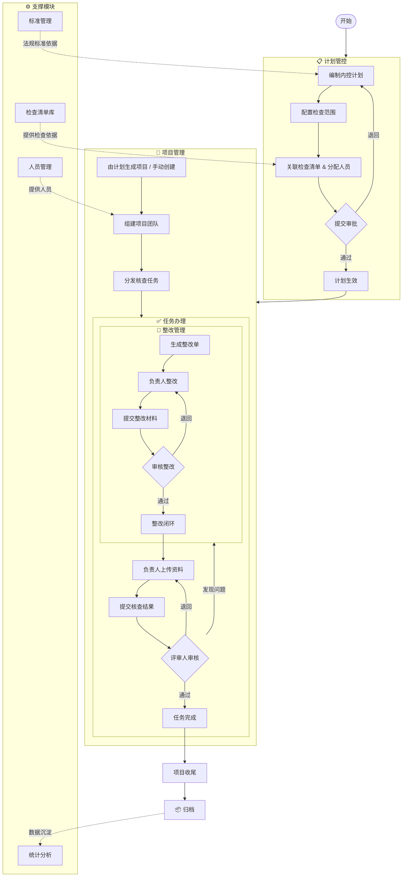
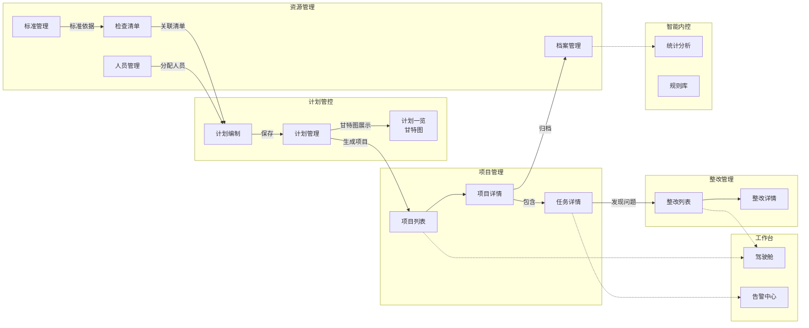
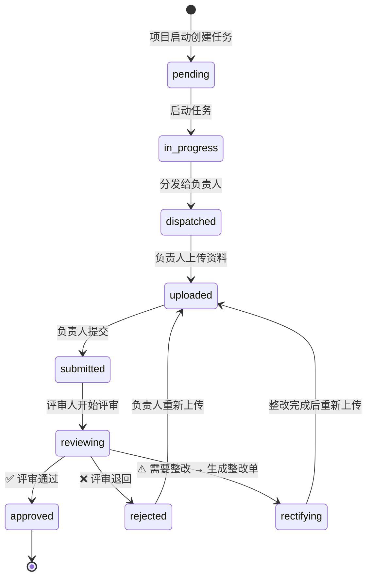
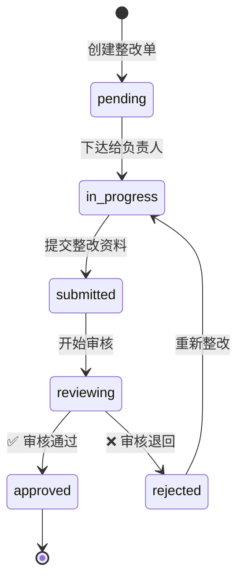
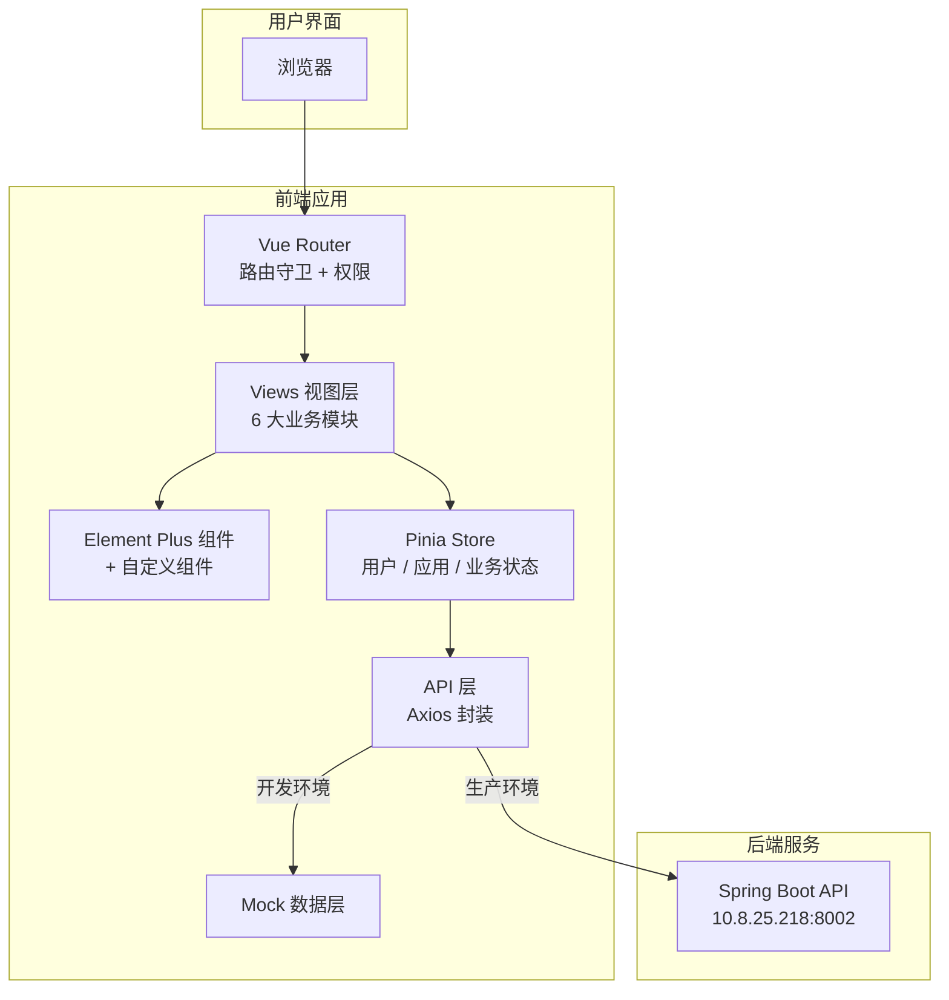
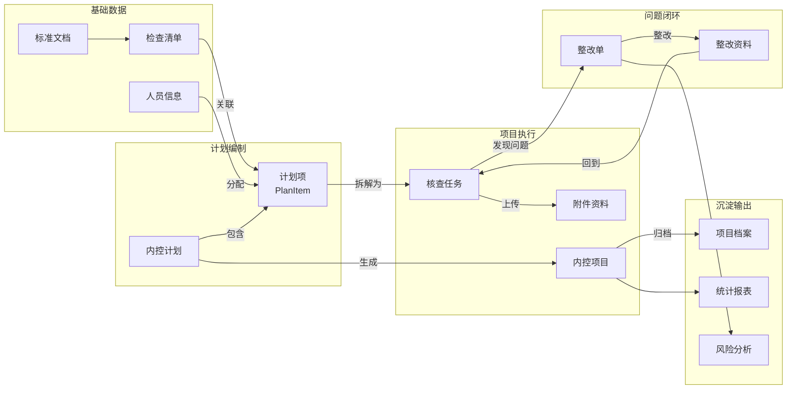

# IRIS 系统流程图

> IT风险及内控管理平台 · 更新于 2026-02-13

---

## 一、系统核心业务流程

```mermaid
flowchart TB
    START([开始]) --> PLAN

    subgraph PLAN["📋 计划管控"]
        P1[编制内控计划] --> P2[配置检查范围]
        P2 --> P3[关联检查清单 & 分配人员]
        P3 --> P4{提交审批}
        P4 -->|退回| P1
        P4 -->|通过| P5[计划生效]
    end

    P5 --> PROJECT

    subgraph PROJECT["📁 项目管理"]
        PR1[由计划生成项目 / 手动创建] --> PR2[组建项目团队]
        PR2 --> PR3[分发核查任务]
        PR3 --> TASK
    end

    subgraph TASK["✅ 任务办理"]
        T1[负责人上传资料] --> T2[提交核查结果]
        T2 --> T3{评审人审核}
        T3 -->|通过| T4[任务完成]
        T3 -->|退回| T1
        T3 -->|发现问题| RECT
    end

    subgraph RECT["🔧 整改管理"]
        R1[生成整改单] --> R2[负责人整改]
        R2 --> R3[提交整改材料]
        R3 --> R4{审核整改}
        R4 -->|退回| R2
        R4 -->|通过| R5[整改闭环]
    end

    R5 --> T1
    T4 --> PR4[项目收尾]
    PR4 --> ARCHIVE[📦 归档]

    subgraph SUPPORT["⚙️ 支撑模块"]
        S1[标准管理]
        S2[检查清单库]
        S3[人员管理]
        S4[统计分析]
    end

    S2 -.->|提供检查依据| P3
    S3 -.->|提供人员| PR2
    S1 -.->|法规标准依据| P1
    ARCHIVE -.->|数据沉淀| S4
```

---

## 二、模块关系图

```mermaid
graph LR
    subgraph 资源管理
        Standards[标准管理]
        Checklists[检查清单]
        Personnel[人员管理]
        Archives[档案管理]
    end

    subgraph 计划管控
        PlanCreate[计划编制]
        PlanList[计划管理]
        PlanOverview[计划一览<br/>甘特图]
    end

    subgraph 项目管理
        ProjList[项目列表]
        ProjDetail[项目详情]
        TaskDetail[任务详情]
    end

    subgraph 整改管理
        RectList[整改列表]
        RectDetail[整改详情]
    end

    subgraph 工作台
        Dashboard[驾驶舱]
        Alerts[告警中心]
    end

    subgraph 智能内控
        Analysis[统计分析]
        Rules[规则库]
    end

    Checklists -->|关联清单| PlanCreate
    Personnel -->|分配人员| PlanCreate
    Standards -->|标准依据| Checklists

    PlanCreate -->|保存| PlanList
    PlanList -->|生成项目| ProjList
    PlanList -->|甘特图展示| PlanOverview

    ProjList --> ProjDetail
    ProjDetail -->|包含| TaskDetail
    TaskDetail -->|发现问题| RectList
    RectList --> RectDetail

    ProjDetail -->|归档| Archives

    ProjList -.-> Dashboard
    RectList -.-> Dashboard
    TaskDetail -.-> Alerts
    Archives -.-> Analysis
```

---

## 三、核查任务状态机

```mermaid
stateDiagram-v2
    [*] --> pending: 项目启动创建任务

    pending --> in_progress: 启动任务
    in_progress --> dispatched: 分发给负责人

    dispatched --> uploaded: 负责人上传资料
    uploaded --> submitted: 负责人提交

    submitted --> reviewing: 评审人开始评审
    reviewing --> approved: ✅ 评审通过
    reviewing --> rejected: ❌ 评审退回
    reviewing --> rectifying: ⚠️ 需要整改 → 生成整改单

    rejected --> uploaded: 负责人重新上传
    rectifying --> uploaded: 整改完成后重新上传

    approved --> [*]
```

---

## 四、整改单状态机

```mermaid
stateDiagram-v2
    [*] --> pending: 创建整改单

    pending --> in_progress: 下达给负责人
    in_progress --> submitted: 提交整改资料
    submitted --> reviewing: 开始审核
    reviewing --> approved: ✅ 审核通过
    reviewing --> rejected: ❌ 审核退回

    rejected --> in_progress: 重新整改
    approved --> [*]
```

---

## 五、前端技术架构

```mermaid
graph TB
    subgraph 用户界面
        Browser[浏览器]
    end

    subgraph 前端应用
        direction TB
        Router[Vue Router<br/>路由守卫 + 权限]
        Views[Views 视图层<br/>6 大业务模块]
        Components[Element Plus 组件<br/>+ 自定义组件]
        Stores[Pinia Store<br/>用户 / 应用 / 业务状态]
        API[API 层<br/>Axios 封装]
        Mock[Mock 数据层]
    end

    subgraph 后端服务
        Backend[Spring Boot API<br/>10.8.25.218:8002]
    end

    Browser --> Router
    Router --> Views
    Views --> Components
    Views --> Stores
    Stores --> API
    API -->|开发环境| Mock
    API -->|生产环境| Backend
```

---

## 六、数据流向图

```mermaid
flowchart LR
    subgraph 基础数据
        A1[标准文档]
        A2[检查清单]
        A3[人员信息]
    end

    subgraph 计划编制
        B1[内控计划]
        B2[计划项<br/>PlanItem]
    end

    subgraph 项目执行
        C1[内控项目]
        C2[核查任务]
        C3[附件资料]
    end

    subgraph 问题闭环
        D1[整改单]
        D2[整改资料]
    end

    subgraph 沉淀输出
        E1[项目档案]
        E2[统计报表]
        E3[风险分析]
    end

    A1 --> A2
    A2 -->|关联| B2
    A3 -->|分配| B2
    B1 -->|包含| B2
    B1 -->|生成| C1
    B2 -->|拆解为| C2
    C2 -->|上传| C3
    C2 -->|发现问题| D1
    D1 -->|整改| D2
    D2 -->|回到| C2
    C1 -->|归档| E1
    C1 --> E2
    D1 --> E3
```
