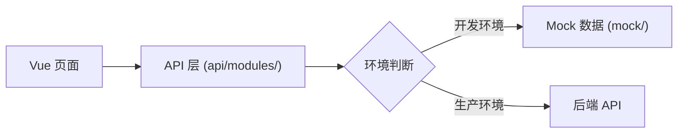

# IRIS 前端项目 — Vue 3 实现方案

## 一、技术选型

### 核心技术栈

| 层级     | 技术       | 版本 | 说明                               |
| -------- | ---------- | ---- | ---------------------------------- |
| 框架     | Vue 3      | 3.5+ | Composition API + `<script setup>` |
| 语言     | TypeScript | 5.x  | 全量 TypeScript                    |
| 构建     | Vite       | 6.x  | 快速构建 & HMR                     |
| 状态管理 | Pinia      | 2.x  | 官方推荐                           |
| 路由     | Vue Router | 4.x  | 官方路由                           |
| HTTP     | Axios      | 1.x  | API 请求封装                       |
| 图表     | ECharts    | 5.x  | 驾驶舱 & 统计分析                  |

### UI 组件库推荐

> [!IMPORTANT]
> 对于企业级内控管理平台，我**推荐 Element Plus**，理由如下。

| 维度            | Element Plus ⭐推荐    | Ant Design Vue    | Naive UI        |
| --------------- | ---------------------- | ----------------- | --------------- |
| **适用场景**    | 后台管理系统（最贴合） | 数据密集型应用    | 追求轻量/定制化 |
| **组件丰富度**  | ⭐⭐⭐⭐⭐ 80+ 组件    | ⭐⭐⭐⭐⭐ 70+    | ⭐⭐⭐⭐ 80+    |
| **表格/表单**   | 功能最全，支持虚拟滚动 | 强大但 API 较复杂 | 够用但生态弱    |
| **文档质量**    | 中英文完善             | 中文文档优秀      | 英文为主        |
| **国内生态**    | 最大社区，案例丰富     | 阿里系生态        | 社区较小        |
| **学习成本**    | 低（大量示例）         | 中等              | 中等            |
| **主题定制**    | CSS Variable 方案      | Design Token      | TypeScript 主题 |
| **TreeShaking** | ✅ 按需引入            | ✅                | ✅              |

**推荐理由**: Element Plus 在国内后台管理系统领域生态最成熟，表格、表单、树形控件等组件完善度高，最适合内控管理平台这种 **表单密集 + 表格密集 + 审批流程** 的业务场景。

### 辅助工具库

| 用途     | 库                      | 说明                           |
| -------- | ----------------------- | ------------------------------ |
| 工具函数 | VueUse                  | Vue Composition API 实用工具集 |
| 日期处理 | Day.js                  | 轻量日期库                     |
| 文件预览 | vue-office              | Word/Excel/PDF 在线预览        |
| 富文本   | WangEditor              | 轻量富文本编辑器               |
| 拖拽     | VueDraggable Plus       | 拖拽排序                       |
| 国际化   | Vue I18n                | 多语言支持                     |
| 图标     | @element-plus/icons-vue | Element Plus 图标库            |

---

## 二、项目架构

### 目录结构

```
iris-web/
├── public/
├── src/
│   ├── api/                    # API 接口层
│   │   ├── modules/            # 按模块组织
│   │   │   ├── resource.ts     # 资源管理
│   │   │   ├── plan.ts         # 计划管控
│   │   │   ├── project.ts      # 项目管理
│   │   │   ├── rectification.ts# 整改管理
│   │   │   ├── workbench.ts    # 工作台
│   │   │   └── smart.ts        # 智能内控
│   │   ├── request.ts          # Axios 封装
│   │   └── types.ts            # API 类型定义
│   ├── assets/                 # 静态资源
│   ├── components/             # 公共组件
│   │   ├── layout/             # 布局组件
│   │   ├── business/           # 业务公共组件
│   │   └── common/             # 通用组件
│   ├── composables/            # 组合式函数
│   ├── directives/             # 自定义指令
│   ├── hooks/                  # 自定义 Hooks
│   ├── layouts/                # 页面布局
│   ├── mock/                   # Mock 数据
│   ├── router/                 # 路由配置
│   │   ├── modules/            # 按模块拆分路由
│   │   └── index.ts
│   ├── stores/                 # Pinia 状态管理
│   │   └── modules/
│   ├── styles/                 # 全局样式
│   ├── types/                  # TypeScript 类型
│   ├── utils/                  # 工具函数
│   ├── views/                  # 页面视图
│   │   ├── resource/           # 1.资源管理
│   │   ├── plan/               # 2.内控计划
│   │   ├── project/            # 3.项目管理
│   │   ├── rectification/      # 4.整改管理
│   │   ├── workbench/          # 5.工作台
│   │   ├── smart/              # 6.智能内控
│   │   └── login/              # 登录页
│   ├── App.vue
│   └── main.ts
├── .env.*                      # 环境变量
├── vite.config.ts
├── tsconfig.json
└── package.json
```

---

## 三、页面清单

### 模块一：资源管理 (`/resource`)

| 页面         | 路由                       | 核心组件                     |
| ------------ | -------------------------- | ---------------------------- |
| 标准管理列表 | `/resource/standards`      | 分类树 + 文档表格 + 上传弹窗 |
| 标准文档详情 | `/resource/standards/:id`  | 文档预览 + 元信息            |
| 内控清单列表 | `/resource/checklists`     | 清单表格 + 导入/导出         |
| 清单详情     | `/resource/checklists/:id` | 清单项列表 + 编辑            |
| 档案台账     | `/resource/archives`       | 项目档案表格 + 快速筛选      |
| 档案详情     | `/resource/archives/:id`   | 档案树 + 文件预览            |
| 人员管理     | `/resource/personnel`      | 人员表格 + 角色标签          |
| 角色管理     | `/resource/roles`          | 角色列表 + 权限配置          |

### 模块二：内控计划管控 (`/plan`)

| 页面     | 路由               | 核心组件                       |
| -------- | ------------------ | ------------------------------ |
| 计划编制 | `/plan/create`     | 周期选择 + 计划项表单          |
| 计划管理 | `/plan/list`       | 计划表格 + 状态筛选 + 变更记录 |
| 计划详情 | `/plan/detail/:id` | 计划信息 + 计划项列表 + 时间线 |
| 计划一览 | `/plan/overview`   | 日历视图 / 甘特图 / 看板视图   |

### 模块三：内控项目管理 (`/project`)

| 页面     | 路由                  | 核心组件                           |
| -------- | --------------------- | ---------------------------------- |
| 项目列表 | `/project/list`       | 项目卡片/表格 + 状态筛选           |
| 项目启动 | `/project/create`     | 步骤表单（选计划/选清单/选团队）   |
| 项目详情 | `/project/detail/:id` | Tab 页（概览/核查清单/团队/文档）  |
| 任务详情 | `/project/task/:id`   | 任务状态流转 + 资料上传 + 评审面板 |
| 项目收尾 | `/project/close/:id`  | 报告预览 + 归档确认                |

### 模块四：整改管理 (`/rectification`)

| 页面       | 路由                        | 核心组件                          |
| ---------- | --------------------------- | --------------------------------- |
| 整改单列表 | `/rectification/list`       | 整改表格 + 状态筛选               |
| 创建整改单 | `/rectification/create`     | 整改表单 + 关联项目/任务          |
| 整改详情   | `/rectification/detail/:id` | 整改信息 + 提交/评审面板 + 时间线 |

### 模块五：内控工作台 (`/workbench`)

| 页面           | 路由                   | 核心组件                           |
| -------------- | ---------------------- | ---------------------------------- |
| 驾驶舱（首页） | `/workbench/dashboard` | ECharts 图表 + 统计卡片 + 待办列表 |
| 告警中心       | `/workbench/alerts`    | 实时告警滚动 + 告警列表 + 级别筛选 |
| 日志中心       | `/workbench/logs`      | 日志表格 + 全文搜索 + 来源筛选     |

### 模块六：智能内控 (`/smart`)

| 页面     | 路由              | 核心组件                         |
| -------- | ----------------- | -------------------------------- |
| 统计分析 | `/smart/analysis` | ECharts 分析图表 + 维度切换      |
| 规则库   | `/smart/rules`    | 规则列表 + 规则编辑器 + 执行记录 |
| 模型库   | `/smart/models`   | 模型卡片 + 配置面板              |
| 工具库   | `/smart/tools`    | 工具卡片 + 调用面板              |

**总计约 24 个页面**

---

## 四、公共组件设计

| 组件            | 用途                             |
| --------------- | -------------------------------- |
| `AppLayout`     | 主布局（侧边栏 + 顶栏 + 内容区） |
| `PageHeader`    | 统一页面标题 + 面包屑            |
| `SearchBar`     | 通用搜索/筛选栏                  |
| `DataTable`     | 增强版表格（分页/排序/列配置）   |
| `FileUploader`  | 统一文件上传组件                 |
| `FilePreview`   | 文档在线预览                     |
| `StatusTag`     | 状态标签（不同颜色/图标）        |
| `Timeline`      | 操作时间线                       |
| `WorkflowPanel` | 任务流转操作面板                 |
| `StatCard`      | 统计数字卡片                     |

---

## 五、API 对接策略

前端项目独立开发，采用 **Mock 先行** 策略：



- 开发阶段使用 `vite-plugin-mock` 提供模拟数据
- API 接口按 RESTful 规范定义，使用 TypeScript 类型约束请求/响应
- 通过环境变量 `VITE_API_BASE_URL` 切换后端地址

---

## 六、开发阶段规划

| 阶段        | 内容                                             | 预估页面数 |
| ----------- | ------------------------------------------------ | ---------- |
| **Phase 1** | 项目脚手架 + 布局 + 登录 + 资源管理（4个子模块） | ~9 页      |
| **Phase 2** | 内控计划管控 + 内控项目管理（核心业务）          | ~9 页      |
| **Phase 3** | 整改管理 + 驾驶舱 + 告警/日志                    | ~6 页      |
| **Phase 4** | 智能内控（统计分析 + 工具库）                    | ~4 页      |

---

## 七、需要确认的问题

| #   | 问题                                                              | 说明             |
| --- | ----------------------------------------------------------------- | ---------------- |
| 1   | **是否同意选用 Element Plus** 作为 UI 组件库？                    | 如有偏好可换     |
| 2   | **是否需要暗色模式**？                                            | 影响主题系统设计 |
| 3   | **是否需要国际化（i18n）**？还是只做中文？                        | 影响文案管理方式 |
| 4   | **后端 API 规范**是否已有？如有请提供，我可以据此定义前端接口类型 | 保持前后端一致   |
| 5   | **是否先从 Phase 1 开始开发**？                                   | 确认开发起点     |

## Verification Plan

### Automated Tests

- Vite 构建无报错验证
- ESLint + Prettier 代码规范检查
- 组件 Vitest 单元测试

### Manual Verification

- 浏览器运行 dev server 验证页面渲染
- 响应式布局测试
