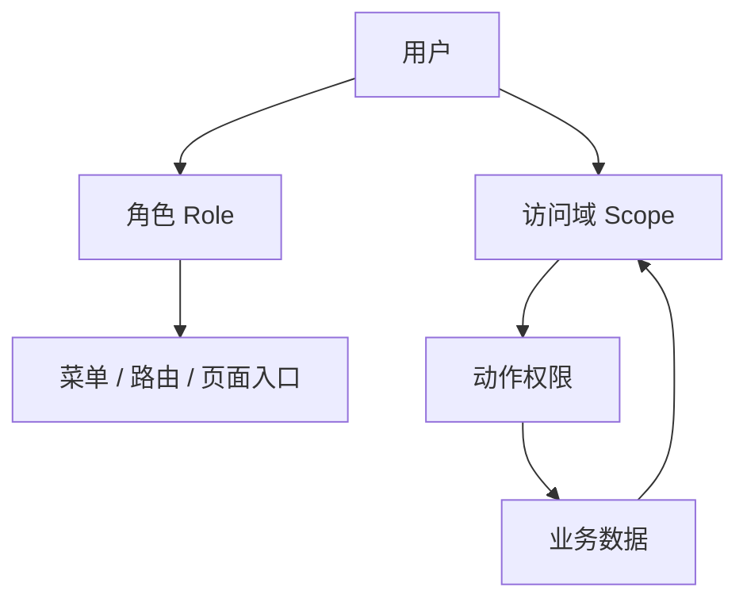
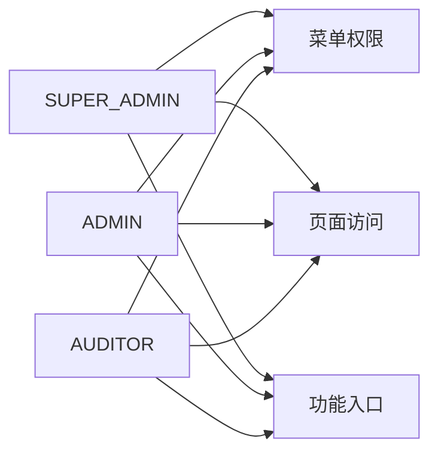
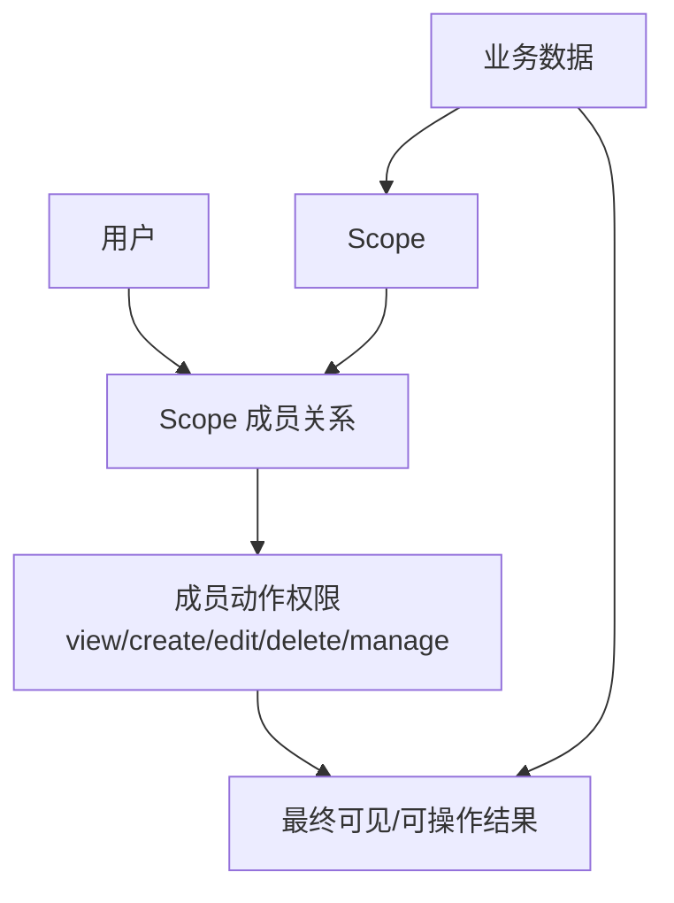
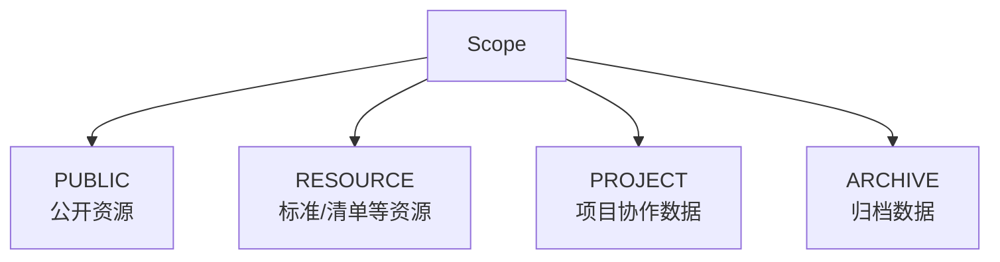
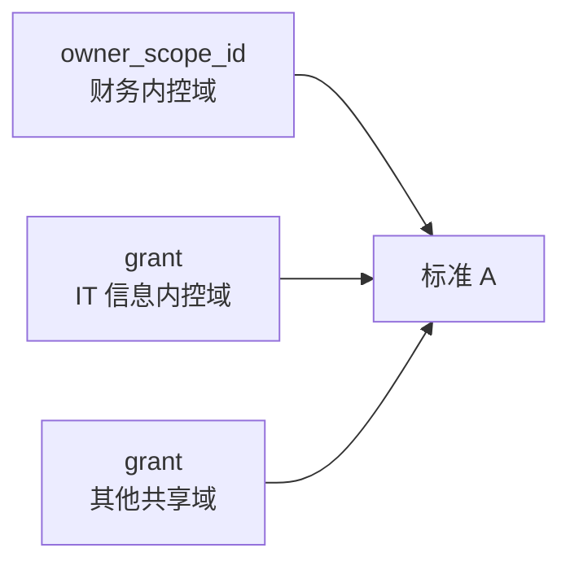
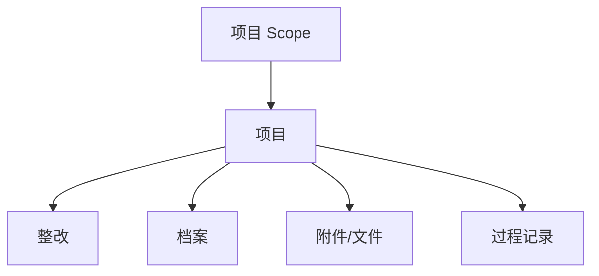
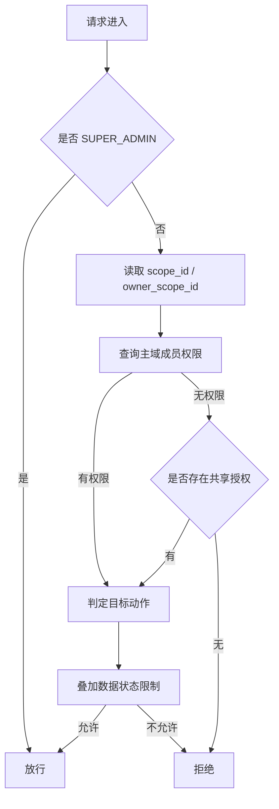
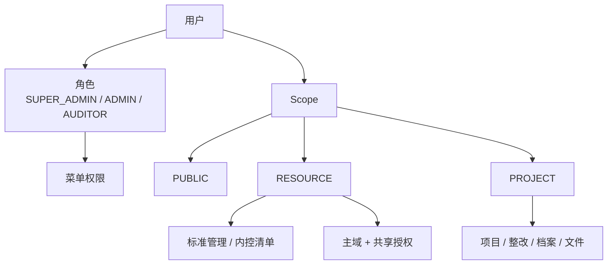

# IRIS 菜单权限与数据权限架构分析

**日期：** 2026-04-22  
**状态：** 草稿，基于当前需求讨论整理  
**范围：** 说明 IRIS 当前阶段最适合的菜单权限与数据权限架构，并分析其边界、优点和落地方式。

## 1. 问题背景

当前 IRIS 的权限需求已经明确分成两类：

1. **菜单权限**
   - 控制用户能进入哪些模块、页面、功能入口
2. **数据权限**
   - 控制用户进入模块后，能看到哪些数据、能对哪些数据执行操作

本次讨论中，菜单权限已经基本稳定：

- 超级管理员
- 管理员
- 审计员

但数据权限不能直接复用这三个角色，因为业务数据的归属方式并不统一：

- 有些数据是资源类数据，例如标准管理、内控清单
- 有些数据是项目类数据，例如项目、整改、档案、项目周期内的文件和记录
- 有些资源可能是公开的
- 有些资源只允许特定范围的人查看或维护
- 一条资源数据还可能被多个业务范围共同使用

因此，菜单权限与数据权限必须拆开设计，不能混为一套模型。

## 1.1 总体架构图

图中表达的是两条独立链路：

- 角色决定用户能进入哪些菜单和页面
- Scope 决定用户对具体数据能看什么、能做什么

## 2. 设计原则

本次权限架构建议遵循以下原则：

1. **菜单权限和数据权限彻底解耦**
   - 菜单由角色控制
   - 数据由业务归属关系控制

2. **数据权限不直接绑定组织部门**
   - 因为实际业务并不总是严格按部门流转
   - 有跨范围使用、共享引用、归档继承等场景

3. **数据权限必须有统一抽象**
   - 否则会演变成“项目一套、团队一套、资源一套”的分裂模型

4. **一条数据只能有一个主维护归属**
   - 否则编辑、删除、发布、责任归属会冲突

5. **可见范围可以共享，维护责任不能共享为默认模式**
   - 共享可以多方可见
   - 但主维护域必须唯一

## 3. 菜单权限架构

菜单权限采用最直接的 `RBAC` 即可。

### 3.0 菜单权限图

### 3.1 角色定义

- `SUPER_ADMIN`
- `ADMIN`
- `AUDITOR`

### 3.2 菜单权限职责

角色只负责下面这些内容：

- 是否显示某个一级菜单或二级菜单
- 是否允许进入某类页面
- 是否显示某类功能入口
- 是否具备某些全局管理类按钮权限

角色**不直接决定**下面这些内容：

- 能看到哪些具体标准
- 能看到哪些清单
- 能看到哪些项目
- 能操作哪一条整改
- 能访问哪一份档案

### 3.3 菜单权限的推荐理解

可以把角色理解成“系统级身份”：

- 超级管理员：系统级全局管理身份
- 管理员：业务管理身份
- 审计员：业务使用身份

角色的职责是决定“能不能进入某类功能区域”，而不是“能不能看到某条业务数据”。

## 4. 数据权限架构

### 4.1 为什么不能直接用角色做数据权限

如果把数据权限直接绑定到角色，会很快出现以下问题：

- 两个同样是管理员的人，实际可见数据范围可能完全不同
- 审计员并不天然拥有全量数据访问权
- 同一个人可能在资源模块中只有查看权，但在某个项目中又有管理权
- 项目类数据与资源类数据的归属逻辑并不一致

因此，数据权限必须独立于角色存在。

### 4.2 推荐抽象：访问域 `Scope`

最适合当前需求的统一抽象是：

**每条数据都归属于一个访问域 `Scope`，用户是否可见、是否可操作，由他在该 `Scope` 中的权限决定。**

也就是：

- 菜单权限：看角色
- 数据权限：看 `scope`

### 4.2.1 Scope 数据权限图

### 4.3 为什么用 `Scope`

`Scope` 是一个统一概念，用来表达“这条数据属于哪个访问范围”。

它可以覆盖不同业务场景：

- 公开资源
- 财务内控资源
- 信息安全资源
- 某个项目
- 某个归档集合

这样权限引擎不需要区分“这次到底是部门、团队、项目还是标签”，只需要判断：

**当前用户在这条数据所属的 `scope` 中有什么权限。**

## 5. Scope 类型划分

当前阶段建议只保留少量类型：

- `PUBLIC`
  - 全员可见的公开数据域
- `RESOURCE`
  - 资源类数据域，例如财务内控域、信息内控域
- `PROJECT`
  - 项目类数据域
- `ARCHIVE`
  - 档案或归档类数据域，通常继承来源项目

这里的 `RESOURCE` 不等于组织部门，而是“资源适用或维护范围”。

例如：

- 财务内控域
- IT 信息内控域
- 审计专项域

这些都可以是资源域。

### 5.1 Scope 类型图

## 6. 数据分类与归属

### 6.1 资源类数据

典型对象：

- 标准管理
- 内控清单

这类数据的特点是：

- 不一定全员共享
- 有的公开
- 有的只允许某个资源域使用
- 有的可能被多个资源域共同引用

因此，资源类数据应归属于 `RESOURCE` 或 `PUBLIC` 类型的 `scope`。

### 6.2 项目类数据

典型对象：

- 项目
- 项目附件
- 项目下整改
- 项目形成的档案
- 项目周期内产生的记录和文件

这类数据的特点是：

- 围绕项目生命周期存在
- 权限天然适合按项目成员关系控制
- 子对象应继承父对象的访问范围

因此，项目类数据应归属于 `PROJECT` 类型的 `scope`。

### 6.3 档案类数据

档案本质上是项目的归档产物。

因此推荐两种做法中的一种：

1. 直接继承原项目 `scope`
2. 在归档时冻结为独立 `ARCHIVE` scope

当前阶段更推荐第一种：**直接继承来源项目权限**，避免新增一套独立规则。

## 7. 资源域中“不同人看到不同数据、操作不同数据”的实现方式

这是资源类权限的核心。

### 7.1 可见范围

用户可见哪些资源数据，取决于：

- 该数据属于哪个 `scope`
- 当前用户是否属于这个 `scope`
- 当前用户在这个 `scope` 中是否具备 `view` 权限

也就是：

**用户能看到的数据 = 他有 `view` 权限的 scope 中的数据 + 公开域数据**

### 7.2 操作范围

用户能否新增、编辑、删除，不由角色决定，而由 `scope` 成员权限决定。

建议资源域内采用动作级权限：

- `view`
- `create`
- `edit`
- `delete`
- `manage`

因此，同样进入“标准管理”页面：

- 有人只能看
- 有人能新增和编辑
- 有人还能删除、发布、调整授权

这正是资源域模型的价值。

### 7.3 数据状态限制

最终可操作范围不能只看域权限，还必须叠加数据自身状态。

例如：

- `draft`：允许编辑
- `published`：默认只读
- `archived`：只读
- `disabled`：不可继续使用

所以最终判断应为：

**最终允许动作 = 资源域成员权限 ∩ 数据状态允许的动作**

## 8. 一条记录对应多个资源域的问题

这是当前讨论中的关键问题。

例如：

- A 标准既给财务内控域使用
- 又给 IT 信息内控域使用

如果直接让一条数据同时拥有多个主 `scope`，会出现下面的问题：

- 到底谁有编辑权
- 到底谁能删除
- 发布责任归谁
- 两边权限不一致时如何裁决

因此，不建议采用“多个主域共同拥有一条数据”的模型。

### 8.1 推荐方案：主域 + 共享授权

一条资源数据只允许有：

- **一个主归属域**
- **多个共享域**

建议建模为：

- `owner_scope_id`
  - 唯一主归属域
  - 决定主维护权
- `resource_scope_grant`
  - 额外共享给哪些域
  - 决定附加可见权或附加协作权

### 8.1.1 主域 + 共享授权图

这张图里：

- `owner_scope_id` 是唯一主维护归属
- grant 是附加共享访问，不替代主归属

### 8.2 这套模型的意义

这样可以把“谁负责维护”与“谁可以使用/查看”分开：

- 主域负责维护
- 共享域负责访问

例如：

- `owner_scope_id = 财务内控域`
- grant 给 `IT 信息内控域`

那么：

- 财务内控域成员：按主域权限进行维护
- IT 信息内控域成员：按 grant 权限访问，通常以查看为主

### 8.3 grant 的建议

第一版建议控制得保守一些：

- 主域：拥有完整维护能力
- 共享域：默认只给 `view`

如果未来确实需要跨域共同维护，再考虑给共享域开放 `edit`，但不建议一开始就默认允许。

### 8.4 如果大量资源长期双边共管

如果某一类资源长期都同时归财务和 IT 共管，不建议逐条做 grant。

更合理的做法是直接建立一个联合资源域，例如：

- `ITGC 资源域`

然后把这类资源统一归到这个联合域下。

## 9. 项目类数据权限

项目类数据建议保持另一条清晰规则：

- 每个项目对应一个 `PROJECT` scope
- 项目成员就是该 scope 成员
- 项目下的整改、档案、附件、过程记录全部继承该 `scope`

### 9.0 项目数据继承图

### 9.1 项目成员权限建议

项目域内建议采用三档权限，避免第一版过细：

- `view`
- `edit`
- `manage`

含义：

- `view`：查看、下载
- `edit`：新增、编辑、提交
- `manage`：成员管理、关键状态变更、删除、归档等

### 9.2 为什么项目数据不再混入资源域

项目数据天然存在生命周期和成员边界，最适合按项目域隔离。

如果把项目数据再和资源域混用，会出现以下问题：

- 同一个项目内不同对象权限不一致
- 子对象继承链断裂
- 查询逻辑复杂
- 页面按钮判断不稳定

因此，建议：

- 资源类数据走资源域
- 项目类数据走项目域
- 两者共用同一套 `scope` 抽象，但不要在一条数据上混用两套归属规则

## 10. 后端权限判断模型

推荐后端统一采用以下顺序：

1. 判断当前用户是否为 `SUPER_ADMIN`
   - 如果是，直接放行
2. 读取目标数据的主 `scope_id` 或 `owner_scope_id`
3. 查询当前用户在该 `scope` 中的成员权限
4. 如果没有成员关系，继续检查是否存在共享授权 `grant`
5. 如果目标动作是查询，要求有 `view`
6. 如果目标动作是新增，要求有 `create` 或项目域内 `edit`
7. 如果目标动作是编辑，要求有 `edit`
8. 如果目标动作是删除或关键管理动作，要求有 `delete` 或 `manage`
9. 最后再叠加数据状态判断

这套顺序的优点是：

- 统一
- 容易审计
- 容易缓存
- 前后端口径一致

### 10.1 后端权限判断流程图

## 11. 前端权限判断模型

前端不要自己决定最终权限，只做展示层控制。

建议前端承担两类职责：

### 11.1 菜单与路由

根据角色控制：

- 是否显示菜单
- 是否允许进入页面

### 11.2 按钮显隐与列表交互

根据后端返回的动作权限控制：

- 是否显示新增按钮
- 是否显示编辑按钮
- 是否显示删除按钮
- 是否允许执行发布、归档、成员维护等操作

前端不应自行推断复杂数据权限，而应尽量消费后端返回的权限结果。

## 12. 推荐数据模型

### 12.1 核心表

- `scope`
  - `id`
  - `scope_code`
  - `scope_name`
  - `scope_type`
  - `status`

- `scope_member`
  - `scope_id`
  - `user_id`
  - `can_view`
  - `can_create`
  - `can_edit`
  - `can_delete`
  - `can_manage`

- `resource_scope_grant`
  - `resource_id`
  - `scope_id`
  - `access_level`

### 12.2 业务表建议字段

资源类表：

- `owner_scope_id`
- `status`

项目类表：

- `scope_id`
- `status`

子对象表：

- 继承父对象 `scope_id`

## 13. 这套架构的优点

1. 菜单权限简单明确，适合快速落地
2. 数据权限与角色解耦，不会把角色用坏
3. 资源类与项目类数据都能统一到 `scope` 模型
4. 支持公开数据、专属数据、共享数据
5. 能解决“一条资源被多个范围使用”的问题
6. 后续扩展新模块时，只需决定它属于哪个 `scope`

## 14. 风险与约束

这套架构成立的前提是：

1. 每条受控数据必须明确归属到一个主 `scope`
2. 不允许无归属数据长期存在
3. 不建议一条数据默认由多个主域共同维护
4. 共享是附加访问能力，不应替代主维护归属
5. 前后端必须统一权限判断口径

如果违反这些前提，权限体系会再次回到“按模块各自解释”的混乱状态。

## 15. 最终结论

当前阶段最适合 IRIS 的权限架构是：

**菜单权限采用角色控制**

- 超级管理员
- 管理员
- 审计员

**数据权限采用统一 `Scope` 模型**

- 公开资源挂 `PUBLIC`
- 标准管理、内控清单等资源类数据挂 `RESOURCE`
- 项目、整改、档案等项目类数据挂 `PROJECT`
- 档案如需独立冻结可扩展为 `ARCHIVE`

**多范围共享场景采用“主域 + 共享授权”**

- 一条数据只有一个主维护域
- 可以共享给多个附加域

这样可以同时解决：

- 菜单权限稳定
- 数据权限统一
- 资源共享可控
- 项目协作清晰
- 归档继承自然

## 15.1 最终推荐总图

这是当前需求下最稳、最容易落地、也最不容易在后期失控的一套方案。
