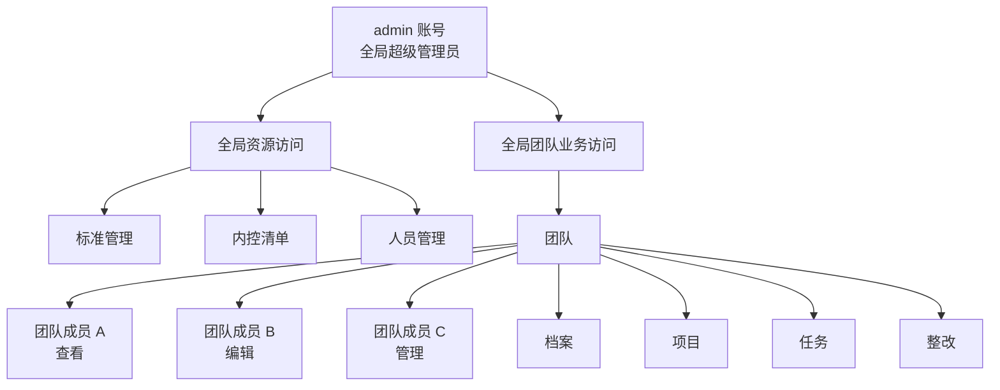
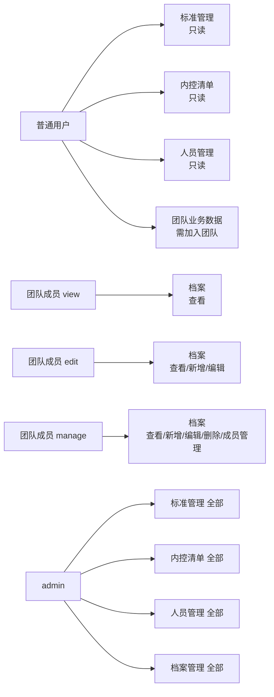

# IRIS 单公司资源权限设计

**日期：** 2026-04-22  
**状态：** 草稿，待确认  
**范围：** 面向单公司部署场景，定义 IRIS 资源管理模块的简化权限模型。

## 1. 设计目标

当前系统先不考虑多租户，只服务于一个公司，因此第一版权限模型的目标不是做一套很重的通用 RBAC，而是先解决下面几个问题：

- 系统默认有一个初始化账号 `admin`
- `admin` 需要能够管理全局所有数据
- 公共资源类数据不应过早切分得太细
- 业务协作类数据需要支持跨部门协作
- 同一个团队内，不同成员可以有不同操作权限
- 后续项目、任务、整改、档案等业务模块，可以沿用同一套思路扩展

本设计优先追求：

- 容易理解
- 容易实现
- 容易扩展

## 2. 当前前提

本设计基于当前讨论和当前系统状态，默认以下前提成立：

- 目前是单公司使用
- 不考虑 `tenant_id`
- 系统默认存在一个初始化账号 `admin`
- 资源管理菜单包括：
  - 标准管理
  - 内控清单
  - 档案管理
  - 人员管理
- 团队可以跨部门拉人
- 团队成员之间可以配置不同权限

## 3. 核心原则

第一版不要把权限设计得太复杂，先只区分两层：

1. **全局层**
   - 只有一个全局超级管理员：`admin`
2. **业务层**
   - 通过团队控制业务数据权限

也就是说，第一版不先做：

- 很多全局角色
- 很复杂的数据范围模板
- 每个菜单一套独立规则
- 部门树级联过滤引擎

第一版先做成：

`admin + 公共资源 + 团队 + 团队成员权限`

## 4. 总体架构图

## 5. 模型说明

### 5.1 `admin` 是什么

`admin` 是一个默认初始化的登录账号，不是抽象概念。

在第一版里，直接把它定义成：

- 全局超级管理员
- 不需要加入任何团队
- 默认拥有全部菜单、全部数据、全部操作权限

也就是说：

- `admin` 可以看所有公共资源
- `admin` 可以看所有团队业务数据
- `admin` 可以维护团队成员
- `admin` 可以配置团队成员权限

这样可以避免一开始就把“默认账号”和“权限身份”混在一起。

### 5.2 团队是什么

团队是业务权限容器，不是组织架构替代品。

建议这样理解：

- 部门：说明这个人属于哪个公司中的哪个组织
- 团队：说明这个人参与了哪些业务协作

团队的作用：

- 可以跨部门组建
- 可以绑定一批业务数据
- 可以控制谁能看、谁能改、谁能管

### 5.3 部门是什么

部门在第一版里保留为组织属性，用于：

- 人员归属
- 页面展示
- 后续审批链扩展
- 报表统计

但第一版资源管理权限，不把部门作为主要隔离维度。

## 6. 团队成员权限模型

团队成员只分 3 档权限：

### 6.1 查看（`view`）

可以：

- 查看团队内业务数据

不可以：

- 新增
- 修改
- 删除
- 管理团队成员

### 6.2 编辑（`edit`）

可以：

- 查看团队内业务数据
- 新增团队内业务数据
- 修改团队内业务数据

不可以：

- 删除高风险数据
- 管理团队成员

### 6.3 管理（`manage`）

可以：

- 查看团队内业务数据
- 新增
- 修改
- 删除或作废（按业务规则）
- 管理团队成员
- 调整团队成员权限

## 7. 数据分类

资源管理里的数据不要全部用同一种权限方式。

建议分成两类。

### 7.1 公共资源数据

这类数据不按团队隔离：

- 标准管理
- 内控清单
- 人员管理

它们是全公司基础资源，适合公司范围复用。

### 7.2 团队业务数据

这类数据按团队隔离：

- 档案管理

后续扩展时，也建议归入团队隔离的业务数据包括：

- 项目
- 任务
- 整改

## 8. 资源管理四个菜单的权限设计

## 8.1 标准管理

### 数据属性

公司级公共资源。

### 设计建议

- 所有登录用户都可以查看
- 只有 `admin` 可以新增、编辑、删除

### 权限建议

| 操作 | 普通用户 | admin |
| --- | --- | --- |
| 查看 | 支持 | 支持 |
| 新增 | 不支持 | 支持 |
| 编辑 | 不支持 | 支持 |
| 删除 | 不支持 | 支持 |

### 说明

标准管理是基础知识库，不适合按团队切分。否则同一家公司内部会很快出现重复标准和维护混乱。

## 8.2 内控清单

### 数据属性

公司级公共模板资源。

### 设计建议

- 所有登录用户都可以查看
- 只有 `admin` 可以新增、编辑、删除

### 权限建议

| 操作 | 普通用户 | admin |
| --- | --- | --- |
| 查看 | 支持 | 支持 |
| 新增 | 不支持 | 支持 |
| 编辑 | 不支持 | 支持 |
| 删除 | 不支持 | 支持 |

### 说明

内控清单本质上是模板库，后续会被计划、项目、检查任务复用，因此应该作为公司级共享资源，而不是团队私有数据。

## 8.3 人员管理

### 数据属性

公司级基础主数据。

### 设计建议

- 所有登录用户都可以查看
- 只有 `admin` 可以新增、编辑、删除
- 删除建议后续改为“停用/离岗”，不要做物理删除

### 权限建议

| 操作 | 普通用户 | admin |
| --- | --- | --- |
| 查看 | 支持 | 支持 |
| 新增 | 不支持 | 支持 |
| 编辑 | 不支持 | 支持 |
| 删除 | 不支持 | 支持 |

### 说明

人员管理不建议按团队隔离。因为人员数据本质上是被团队引用的基础资源池，不应该反过来被团队本身限制。

## 8.4 档案管理

### 数据属性

团队业务数据。

### 设计建议

- `admin` 可以查看和管理所有档案
- 普通用户只有在团队内才可访问档案
- 团队内按 `view / edit / manage` 决定能做什么

### 权限建议

| 操作 | 非团队成员 | 团队成员 view | 团队成员 edit | 团队成员 manage | admin |
| --- | --- | --- | --- | --- | --- |
| 查看 | 不支持 | 支持 | 支持 | 支持 | 支持 |
| 新增 | 不支持 | 不支持 | 支持 | 支持 | 支持 |
| 编辑 | 不支持 | 不支持 | 支持 | 支持 | 支持 |
| 删除/作废 | 不支持 | 不支持 | 不支持 | 支持 | 支持 |
| 管理团队成员 | 不支持 | 不支持 | 不支持 | 支持 | 支持 |

### 说明

档案是具体业务协作产物，最适合跟随团队走权限，而不是作为公司公共资源开放。

## 9. 资源权限矩阵汇总

## 10. 推荐数据结构

为了支撑这套模型，后续业务数据建议逐步引入 `team_id`。

### 10.1 业务表建议字段

适用于后续需要团队隔离的业务表：

- `team_id`

推荐逐步应用到：

- 档案
- 项目
- 任务
- 整改

### 10.2 团队成员关系表

建议维护一张团队成员表，结构至少包括：

- `team_id`
- `user_id`
- `permission_level`

其中 `permission_level` 建议值：

- `view`
- `edit`
- `manage`

## 11. 后端判断逻辑

后端访问团队业务数据时，建议统一按下面逻辑处理：

1. 如果当前用户是 `admin`，直接放行。
2. 读取业务数据的 `team_id`。
3. 查询当前用户是否属于该团队。
4. 如果不是团队成员，拒绝访问。
5. 如果是团队成员，再判断成员权限等级：
   - `view`：只能读
   - `edit`：可新增和修改
   - `manage`：可做高权限操作

这套逻辑适用于：

- 列表查询
- 详情查询
- 新增
- 编辑
- 删除/作废

## 12. 典型场景示例

### 场景 1：`admin`

- 能看所有标准
- 能管所有清单
- 能看所有人员
- 能看所有档案
- 能维护所有团队成员

### 场景 2：普通员工，未加入任何团队

- 能看标准管理
- 能看内控清单
- 能看人员管理
- 不能看任何团队档案

### 场景 3：普通员工，加入 A 团队，权限为 `view`

- 能看标准、清单、人员
- 能看 A 团队档案
- 不能新增和编辑 A 团队档案

### 场景 4：普通员工，加入 A 团队，权限为 `edit`

- 能看标准、清单、人员
- 能看 A 团队档案
- 能新增和编辑 A 团队档案
- 不能管理团队成员

### 场景 5：普通员工，加入 A 团队，权限为 `manage`

- 拥有 A 团队档案的完整业务权限
- 可以调整 A 团队成员权限

## 13. 第一版落地建议

第一版强烈建议只做下面这些：

1. 保留 `admin` 为唯一全局超级管理员。
2. 标准管理、内控清单、人员管理作为公共资源。
3. 档案管理作为团队隔离业务数据。
4. 团队成员权限只做 `view / edit / manage` 三档。
5. 不先做复杂角色中心。

## 14. 后续扩展路径

等第一版跑顺以后，可以逐步扩展：

### 14.1 新增全局业务角色

例如：

- 资源维护员
- 档案维护员
- 审核员

### 14.2 引入部门维度

用于：

- 审批链
- 汇总统计
- 部门负责人视角

### 14.3 引入状态权限

例如：

- 草稿可编辑
- 已提交不可编辑
- 已归档只能作废不能修改

### 14.4 细分动作权限

例如把 `manage` 继续拆成：

- 删除
- 导出
- 发布
- 停用

## 15. 最终建议

对于当前阶段，最合适的方案是：

- `admin` 作为全局超级管理员
- 公共资源统一公司内共享：
  - 标准管理
  - 内控清单
  - 人员管理
- 团队业务数据按团队隔离：
  - 档案管理
- 团队成员权限采用三档：
  - `view`
  - `edit`
  - `manage`

这套方案足够简单，容易理解，也符合 IT 内控系统后续向项目、任务、整改扩展的方向。
