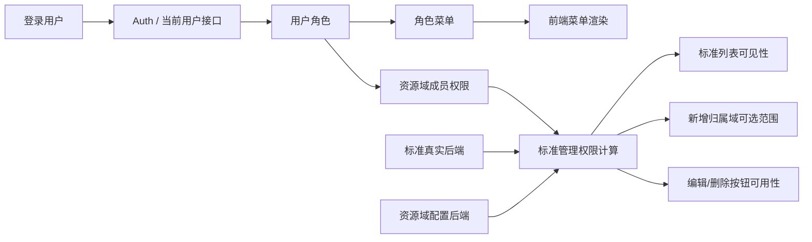

# IRIS 标准管理真实后端与权限闭环设计

**日期：** 2026-04-23  
**状态：** 已确认，待转实现计划  
**范围：** 在现有登录鉴权基础上，打通角色菜单、资源域配置、标准管理真实后端数据，并用标准管理页验证整套权限链路。

## 1. 设计目标

这一轮不是继续扩散更多权限概念，而是先做一个能落地、能联调、能验证的闭环。闭环包含三条主链路：

- 角色菜单真实生效
- 资源域配置真实可维护
- 标准管理完全切到真实后端数据，并按资源域权限工作

完成后，系统需要满足以下结果：

- 登录用户左侧菜单由真实角色菜单决定
- 资源域配置页可以维护标准管理要消费的资源域和成员权限
- 标准管理页不再依赖 mock 数据
- 标准管理页的查看、新增、编辑、删除等行为，由当前用户在归属资源域上的权限决定

## 2. 当前事实

基于当前代码状态，已经可以确认：

- 登录鉴权链路已存在
- 角色管理后端已经有 `sys_role`、`sys_role_menu` 及对应接口
- 资源域配置后端已经有 `sys_resource_scope`、`sys_resource_scope_member` 及对应接口
- 前端标准管理页已经具备基于 `visibilityLevel`、`ownerScopeId`、`grants` 的权限计算雏形
- 前端 `standardApi` 已定义，但 `IRIS-BACK` 中还没有真实的标准管理后端实现
- 前端标准管理当前仍以 mock 数据为主

因此，这一轮要达到“完全切到真实后端数据”，必须补上标准管理后端最小业务模块。

## 3. 本轮边界

### 3.1 纳入范围

- 角色菜单保存、查询、登录后菜单计算
- 资源域定义及资源域成员权限维护
- 标准管理真实后端表结构、接口、种子数据
- 标准管理页从真实接口读取和写入
- 标准管理页按资源域权限计算页面行为

### 3.2 不纳入范围

- 更复杂的数据权限引擎
- 通用化到所有业务模块的权限中台
- 标准审批流、发布流重构
- 标准附件上传链路重做
- 多租户复杂隔离策略调整

这一轮只解决“标准管理实验链路能跑通”，不解决权限平台长期形态。

## 4. 推荐方案

推荐采用“最小真实闭环方案”：

1. 后端补齐标准管理最小模块
2. 修正角色菜单链路的保存和回显
3. 保持资源域作为标准管理的数据权限来源
4. 前端标准管理完全切到真实标准接口

不推荐继续保留标准 mock 作为主数据源。那会让本轮无法验证：

- 资源域权限是否真的控制了标准数据
- 角色菜单是否真正与业务页面联通
- 前后端数据模型是否一致

## 5. 总体架构

核心思路是：

- 菜单权限由角色菜单决定
- 数据权限由资源域成员权限决定
- 标准数据本身携带归属域和可见性
- 前端只负责把真实后端数据映射成页面行为，不再自造业务数据

## 6. 后端设计

## 6.1 角色菜单

角色菜单仍然使用现有 `sys_role_menu`。

本轮要求：

- 角色创建时保存 `menuCodes`
- 角色更新时完整替换 `menuCodes`
- 角色详情和列表返回时包含完整 `menuCodes`
- 当前登录用户菜单集合按“用户角色 -> 角色菜单”真实计算

这里不引入额外的前端兜底菜单推导规则，避免角色配置与实际展示脱节。

## 6.2 资源域

资源域继续使用现有两张表：

- `sys_resource_scope`
- `sys_resource_scope_member`

标准管理只消费两类结果：

- 可选资源域列表
- 当前用户在各资源域上的动作权限集合

动作维持现有五档：

- `view`
- `create`
- `edit`
- `delete`
- `manage`

其中 `manage` 代表资源域成员维护能力，同时视为包含全部基础动作。

## 6.3 标准管理真实后端

新增标准管理最小业务模块，建议放在 `iris-back-business`，避免混入 `system` 模块。

建议新增标准主表 `biz_standard`，字段至少包括：

- `id`
- `tenant_id`
- `standard_group_id`
- `title`
- `category`
- `version`
- `version_number`
- `previous_version_id`
- `publish_date`
- `status`
- `description`
- `change_log`
- `visibility_level`
- `owner_scope_id`
- `shared_scope_ids`
- `deleted`
- `version`
- `created_by`
- `updated_by`
- `created_at`
- `updated_at`

其中：

- `visibility_level` 取值为 `PUBLIC` 或 `SCOPED`
- `owner_scope_id` 表示归属资源域
- `shared_scope_ids` 这一轮先允许用简单字符串存储，优先完成闭环，不提前引入关联表

这套结构已经足够支撑标准管理页当前页面行为。

## 6.4 标准接口

标准管理后端先提供最小 CRUD：

- `GET /api/v1/standards`
- `GET /api/v1/standards/{id}`
- `POST /api/v1/standards`
- `PUT /api/v1/standards/{id}`
- `DELETE /api/v1/standards/{id}`

列表接口返回标准管理页直接可消费的数据字段，不增加额外包装层。

本轮不额外拆“标准摘要 DTO”和“标准详情 DTO”的复杂层次，优先保持模型简单。

## 7. 前端设计

## 7.1 菜单链路

前端用户信息中的 `menuCodes` 统一以真实后端返回为准。

前端侧只保留：

- 当前用户菜单集合存储
- 基于 `menuCodes` 的路由和侧边栏过滤

前端不再自行猜测角色应拥有的菜单。

## 7.2 资源域配置页

资源域配置页继续承担两件事：

- 维护资源域定义
- 维护资源域成员动作权限

它是标准管理页的数据权限上游，不再只是演示页面。

联调要求：

- 修改资源域成员权限后，刷新当前用户上下文可以影响标准管理页行为
- 平台管理员和具备资源域菜单权限的角色都能进入该页

## 7.3 标准管理页

标准管理页需要做三类改造：

1. 数据源切换  
   从 mock 数据切到真实 `standardApi`

2. 范围数据切换  
   资源域选项和资源域标签来自真实资源域接口

3. 权限行为保留  
   继续使用当前前端权限计算逻辑，但输入改为真实标准数据和真实用户资源域权限

页面上应保持以下行为：

- 列表只显示当前用户可见标准
- 新增时只能选择当前用户有 `create` 权限的归属域
- 编辑时要求对归属域具备 `edit`
- 删除时要求对归属域具备 `delete`
- `PUBLIC` 标准允许所有登录用户查看，但不自动获得编辑能力
- `SCOPED` 标准只对归属域和共享域内可查看用户可见

## 7.4 标准管理查询交互规则

标准管理页的查询交互采用“显式查询为主，输入联动为辅”的规则，避免页面在服务端权限过滤场景下出现高频无效请求和无反馈操作。

页面行为约束如下：

- 搜索框输入内容后，不在每次输入时立即请求后端
- 用户点击 `查询` 按钮时触发列表查询
- 用户在搜索框内按 `Enter` 时，触发与 `查询` 按钮完全一致的查询行为
- 用户点击 `重置` 时，清空筛选条件并立即重新查询全量列表
- 即使当前没有任何筛选条件，点击 `查询` 也必须触发一次全量列表刷新，不能无反应
- 每次触发查询时，表格必须进入明确的 `loading` 状态，并在查询前将分页重置到第 1 页
- 如后续需要增强体验，可以增加 `300-500ms` 的防抖自动查询，但这只能作为增强能力，不能替代 `查询` 按钮和 `Enter` 查询

这条规则的目的不是做本地筛选，而是统一服务端查询入口，让用户明确理解：

- 有条件时，按条件查询
- 无条件时，刷新全量列表
- 查询按钮始终有效，且始终有页面反馈

## 8. 权限判定规则

## 8.1 菜单权限

菜单是否展示，只看：

- 用户当前角色集合
- 角色绑定的 `menuCodes`

与资源域成员权限无关。

## 8.2 标准可见性

标准可见性规则如下：

### `PUBLIC`

- 所有登录用户可查看
- 编辑、删除仍只看归属域动作权限

### `SCOPED`

满足以下任一条件即可查看：

- 当前用户是平台管理员
- 当前用户对 `ownerScopeId` 具备 `view`
- 当前用户对任一 `sharedScopeIds` 中的资源域具备 `view`

## 8.3 标准可操作性

### 新增

满足以下任一条件可新增：

- 平台管理员
- 对所选归属域具备 `create`

### 编辑

满足以下任一条件可编辑：

- 平台管理员
- 对标准的 `ownerScopeId` 具备 `edit`

### 删除

满足以下任一条件可删除：

- 平台管理员
- 对标准的 `ownerScopeId` 具备 `delete`

### 管理资源域成员

满足以下任一条件可维护资源域成员：

- 平台管理员
- 对目标资源域具备 `manage`

## 9. 错误处理

### 后端

- 标准不存在时返回明确业务错误
- 资源域不存在时返回明确业务错误
- 提交的 `owner_scope_id` 不存在时拒绝写入
- 写入 `shared_scope_ids` 时过滤非法 scope id

### 前端

- 标准列表加载失败时给出错误提示
- 资源域列表加载失败时禁止提交依赖资源域的数据表单
- 当前用户无可创建资源域时，禁用新增按钮并给出提示

## 10. 测试策略

## 10.1 后端

至少覆盖：

- 角色菜单保存与回显
- 当前用户菜单计算
- 资源域列表与成员替换
- 标准列表、详情、新增、编辑、删除
- 标准 `PUBLIC` / `SCOPED` 字段映射

## 10.2 前端

至少覆盖：

- 角色菜单过滤
- 资源域 DTO 到页面模型转换
- 标准权限计算
- 标准页真实接口接入后的类型检查

## 10.3 联调场景

至少验证三类用户：

- 平台管理员
- 资源域管理员
- 只读审计员

验证内容包括：

- 登录后菜单可见性
- 资源域配置页可达性
- 标准管理列表可见性
- 新增、编辑、删除按钮权限
- 标准归属域和共享域显示是否正确

## 11. 最终建议

本轮最合适的落地方式是：

- 修好角色菜单真实保存、查询、菜单生效链路
- 保持资源域作为标准管理的数据权限源
- 在后端补齐标准管理最小模块
- 前端标准管理页彻底切到真实接口

这样可以先把权限体系跑成一个完整样板。样板一旦稳定，后续再把同样模式复制到清单、档案、项目、整改单等模块，成本会明显更低。
